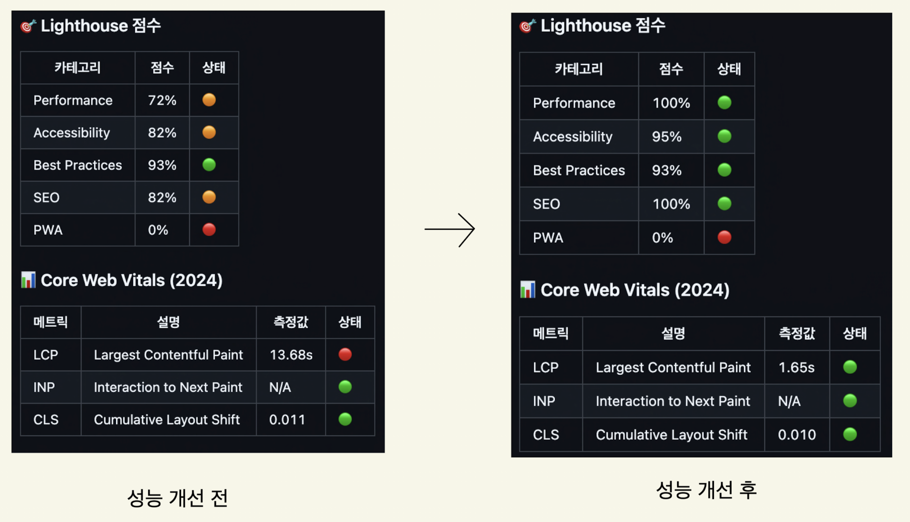

# 바닐라 JS 프로젝트 성능 개선

- url: https://d1lwozd0ydggxa.cloudfront.net/

## 성능 개선 보고서

### 최종 결과



<hr>

### 개선 항목

1. [이미지 최적화](#이미지-최적화)
2. [script 태그 로드 최적화](#script-태그-로드-최적화)
3. [SEO 최적화](#seo-최적화)
4. [폰트 최적화](#폰트-최적화)

---

## 이미지 최적화

### 🖼 정적 이미지 개선

기존에는 `.jpg`, `.png` 같은 전통적인 이미지 포맷을 사용하였으나,  
**차세대 이미지 포맷(WebP) + `<picture>` 태그**를 적용하여 최적화하였습니다.

```
✅ 적용된 최적화

WebP 포맷 사용 → 파일 크기 30~50% 감소
<picture> 태그 사용 → 디바이스별 최적 해상도 이미지 선택
fetchpriority="high" 적용 → LCP (Largest Contentful Paint) 성능 개선
SEO 최적화 → Google이 차세대 포맷(WebP)을 인식하여 검색 순위 향상
```

### 💃🏻동적 이미지 개선

페이지 내에서 동적으로 추가되는 Product 이미지에도 `Lazy Loading`을 적용하여
사용자가 화면을 스크롤할 때만 필요한 이미지를 로드하도록 개선하였습니다.

```diff
const pictureDiv = document.createElement("div");
pictureDiv.classList.add("product-picture");
const img = document.createElement("img");
img.src = product.image;
img.alt = `product: ${product.title}`;
img.width = 250;
+ img.loading = "lazy";
pictureDiv.appendChild(img);
```

```
✅ 적용된 최적화

Lazy Loading (loading="lazy") 적용
→ 보이지 않는 이미지는 로드되지 않음
불필요한 네트워크 요청 방지
→ 페이지 로딩 속도 개선 & 사용자 데이터 절약
Lighthouse 성능 점수 향상
→ Google PageSpeed Insights에서 이미지 최적화 점수 증가
```

<br>
<br>

---

## script 태그 로드 최적화

기존 코드에서는 스크립트가 <body> 태그 위에 위치하여 로딩 속도를 저하시켰습니다.<br>
Google Tag Manager (GTM) 및 Cookie Consent 스크립트 로딩 최적화 미흡
GTM 및 Cookie Consent 스크립트가 동기적으로 실행될 경우 페이지 로딩 속도 저하 발생 가능성이 있어, async, defer 속성을 활용해 개선하였습니다.

| **스크립트**                  | **최적화 방식** | **설명**                                     |
| ----------------------------- | --------------- | -------------------------------------------- |
| **Google Tag Manager (GTM)**  | `async`         | 비동기 로드 적용하여 페이지 렌더링 차단 방지 |
| **Cookie Consent 라이브러리** | `defer`         | HTML 파싱이 끝난 후 실행되도록 설정          |

<br>
<br>
✅ **Google Tag Manager (GTM)에는 `async` 적용**

- `async`는 브라우저가 **HTML 파싱을 멈추지 않고 스크립트를 다운로드 & 실행**함.
- GTM은 페이지가 빠르게 로드되면서 이벤트를 추적해야 하기 때문에 `async`가 적절함.

✅ **Cookie Consent 라이브러리에는 `defer` 적용**

- `defer`는 브라우저가 **HTML 파싱이 끝난 후 실행**하도록 함.
- 사용자 경험과 직접적인 연관이 적고, 후순위로 실행되어도 무방하므로 `defer` 사용.
  <br>
  <br>
  <br>

---

## SEO 최적화

SEO 성능을 향상시키기 위해 `메타 태그` 추가, 이미지 `alt` 속성 추가, 접근성을 위한 `aria` 속성 추가를 적용하였습니다.
<br>
<br>

| **최적화 항목**            | **적용 방식**                  | **설명**                                  |
| -------------------------- | ------------------------------ | ----------------------------------------- |
| **메타 태그 추가**         | `<meta>` 태그 개선             | 검색 엔진과 SNS에서의 정보 제공 강화      |
| **이미지 `alt` 속성 추가** | `` 태그의 `alt` 속성 추가 | 이미지 대체 텍스트 제공으로 SEO 점수 상승 |
| **ARIA 속성 추가**         | `aria-label` 속성 추가         | 접근성을 높여 웹 표준 준수 및 SEO 개선    |

<br>
<br>

---

## 폰트 최적화

기존에는 Google Fonts에서 웹폰트를 외부에서 로드하여 사용했으며, 이로 인해 성능 저하가 발생했습니다.
웹폰트를 로컬에서 제공하여 네트워크 요청 최소화 하여 렌더링 차단 없이 빠른 폰트 로딩으로 개선하였습니다.

| **최적화 항목**        | **적용 방식**                          | **설명**                        |
| ---------------------- | -------------------------------------- | ------------------------------- |
| **웹폰트 로드 최적화** | 외부 Google Fonts → `로컬 폰트`로 변경 | 네트워크 요청 최소화, 성능 향상 |

---

<br>
<br>

# 최종 성능 향상 지표

## 📌 Lighthouse 점수 비교

| 카테고리           | 개선 전 | 개선 후 | 변화        |
| ------------------ | ------- | ------- | ----------- |
| **Performance**    | 72% 🔶  | 100% 🟢 | **+28%** 🚀 |
| **Accessibility**  | 82% 🔶  | 95% 🟢  | **+13%** 📈 |
| **Best Practices** | 93% 🟢  | 93% 🟢  | 동일        |
| **SEO**            | 82% 🔶  | 100% 🟢 | **+18%** 🔥 |
| **PWA**            | 0% 🔴   | 0% 🔴   | 동일        |

<br>

## 📌 Core Web Vitals 비교 (2024)

| 메트릭  | 설명                      | 개선 전       | 개선 후      | 변화           |
| ------- | ------------------------- | ------------- | ------------ | -------------- |
| **LCP** | Largest Contentful Paint  | **13.68s** 🔴 | **1.65s** 🟢 | **-12.03s** ⚡ |
| **INP** | Interaction to Next Paint | N/A 🟢        | N/A 🟢       | 동일           |
| **CLS** | Cumulative Layout Shift   | **0.011** 🟢  | **0.010** 🟢 | 개선           |

<br>

✅ 📈 최적화 효과 요약<br>
Performance (72% → 100%)<br>
→ LCP 최적화 (13.68s → 1.65s) 적용으로 로딩 속도 대폭 개선<br><br>
SEO (82% → 100%)<br>
→ 메타 태그 추가, alt 속성 적용, 웹 접근성 향상<br><br>
Accessibility (82% → 95%)<br>
→ aria 속성 추가 및 HTML 구조 최적화<br><br>
CLS 개선 (0.011 → 0.010)<br>
→ 레이아웃 변경 최소화로 사용자 경험 향상

✅ Core Web Vitals의 LCP가 크게 개선되면서 웹사이트의 로딩 속도가 최적화 되었습니다! 🚀

✅ SEO, 접근성, 사용자 경험까지 전반적인 성능이 향상 되었습니다!
