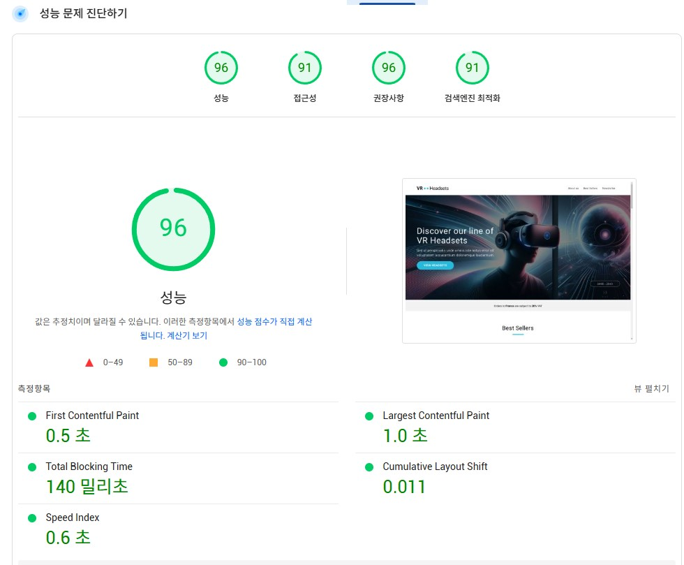

## 주요 링크

  - S3 버킷 웹사이트 엔드포인트: http://front-4th-chapter4-2-basic.s3-website-ap-southeast-2.amazonaws.com/
  - CloudFront 배포 도메인 이름: d2ik0a44093kkh.cloudfront.net

## 성능 개선 보고서

1. 개선 이유
  기존 예제 PageSpeed Insights 성능 분석 결과 성능 점수가 67점으로 집계되었습니다.
  콘텐츠의 초기 로딩 시간과(LCP) 로딩중 콘텐츠 위치가 변경되는 경우가(CLS) 많아 점수가 낮았습니다.
  부가적으로 이미지 alt 태그 작성과 폰트 직접 호출을 통한 개선의 여지가 보입니다. 

2. 개선 방법
  - jpg 이미지 용량 최적화를 위한 확장자 변경
      기존 jpg, png 파일을 화질 손실 없게 용량을 줄일 수 있는 webp 확장자로 변경

  - 웹에 적용된 사이즈만큼 이미지 크기 최적화
      이미지 사이즈보다 웹에 적용된 사이즈에 차이가 있어 이미지 사이즈 적절하게 수정
  
  - 일반 img 호출해 css로 반응형 적용하지 않고 picture 태그 활용해 반응형 적용 

  - 웹폰트 css에서 직접 불러오도록 수정

  - 이미지 alt 태그 작성

3. 개선 후 향상된 지표
  이미지 총 용량 2.38mb -> 782kb 67.14% 감소
  
  성능 점수 기존 67점 -> 96점
    LCP 3.3초 -> 1.0초 
    CLS 0.516 -> 0.011

  접근성 기존 82점 -> 91점

  검색엔진 최적화 기존 82점 -> 91점

  

4. 기타