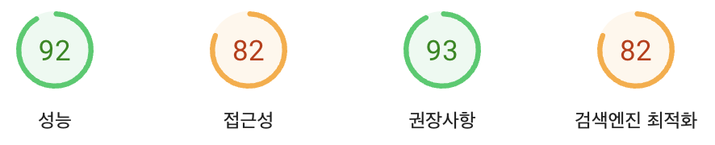
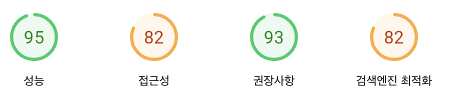
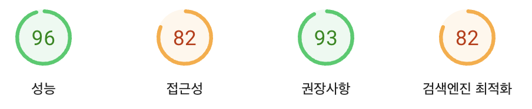

# 바닐라 JS 프로젝트 성능 개선 보고서

- 웹사이트 주소: https://d267jtlyf6x8wq.cloudfront.net/

## 1. 개선 배경 및 목표

### 개선 전 상태

웹사이트 성능 분석 결과, 특히 모바일 환경에서 성능 점수가 66점으로 저조한 상태였습니다. 이는 페이지 로딩 속도가 느리고 사용자 경험이 좋지 않다는 것을 의미합니다.

### 개선 목표

- 웹사이트 로딩 속도 향상
- 모바일 환경에서의 사용자 경험 개선
- Google의 성능 평가 점수 90점 이상 달성

## 2. 주요 개선 사항 및 결과

### 2-1. 이미지 최적화

**개선 내용:**

- 이미지 파일 형식을 JPG에서 WEBP로 변경
  - WEBP는 최신 이미지 형식으로, 같은 품질에서 JPG보다 파일 크기가 30-50% 작습니다
- 사용자 기기에 맞는 적절한 크기의 이미지 제공
  - 모바일에서는 작은 이미지, 데스크톱에서는 큰 이미지를 자동으로 불러옵니다
- 이미지에 정확한 크기(width, height) 지정
  - 브라우저가 이미지 공간을 미리 확보하여 페이지 레이아웃이 안정적으로 유지됩니다

**개선 결과:**

성능 점수가 66점에서 92점으로 **26점 향상**되었습니다. 이는 페이지 로딩 속도가 크게 개선되었음을 의미합니다.

### 2-2. 폰트 최적화

**개선 내용:**

- 외부 웹폰트 API 호출 제거
  - 기존에는 Google Fonts와 같은 외부 서비스에서 폰트를 불러왔습니다
- 필요한 폰트 파일을 웹사이트에 직접 포함
  - 추가 네트워크 요청 없이 폰트를 빠르게 로드할 수 있습니다

**개선 결과:**

성능 점수가 92점에서 95점으로 **3점 추가 향상**되었습니다. 페이지 초기 로딩 시 텍스트가 더 빠르게 표시됩니다.

### 2-3. 자바스크립트 파일 병렬 로딩

**개선 내용:**

- 자바스크립트 파일을 병렬로 불러오도록 개선
  - 기존: 파일을 하나씩 순차적으로 로드 (직렬 처리)
  - 개선: 여러 파일을 동시에 로드 (병렬 처리)
- 'defer' 속성 추가로 페이지 로딩과 스크립트 로딩을 동시에 진행

**개선 결과:**

성능 점수가 95점에서 96점으로 **1점 추가 향상**되었습니다. 페이지 콘텐츠가 더 빠르게 표시되고 상호작용이 가능해집니다.

## 3. 종합 개선 결과

### 성능 점수 변화

- **개선 전**: 66점 (모바일)
- **개선 후**: 96점 (모바일)
- **총 향상**: 30점 (45% 향상)

### 사용자 경험 개선 효과

- 페이지 로딩 시간 단축
- 콘텐츠가 더 빠르게 표시됨
- 페이지 레이아웃 안정성 향상
- 모바일 기기에서의 응답성 개선

## 4. 결론 및 향후 계획

이번 성능 최적화를 통해 웹사이트의 로딩 속도와 사용자 경험이 크게 개선되었습니다. 특히 모바일 환경에서 성능 점수가 66점에서 96점으로 향상되어 목표를 초과 달성했습니다.

향후에도 지속적인 모니터링과 최적화를 통해 웹사이트 성능을 유지하고 개선해 나갈 계획입니다.

## 5. 참고 자료

- 성능 측정 도구: [Google PageSpeed Insights](https://pagespeed.web.dev/)
- 최종 성능 측정 결과:
  - [모바일 환경 분석](https://pagespeed.web.dev/analysis/https-d267jtlyf6x8wq-cloudfront-net/45ywyaf7e3?form_factor=mobile)
  - [데스크톱 환경 분석](https://pagespeed.web.dev/analysis/https-d267jtlyf6x8wq-cloudfront-net/45ywyaf7e3?form_factor=desktop)
