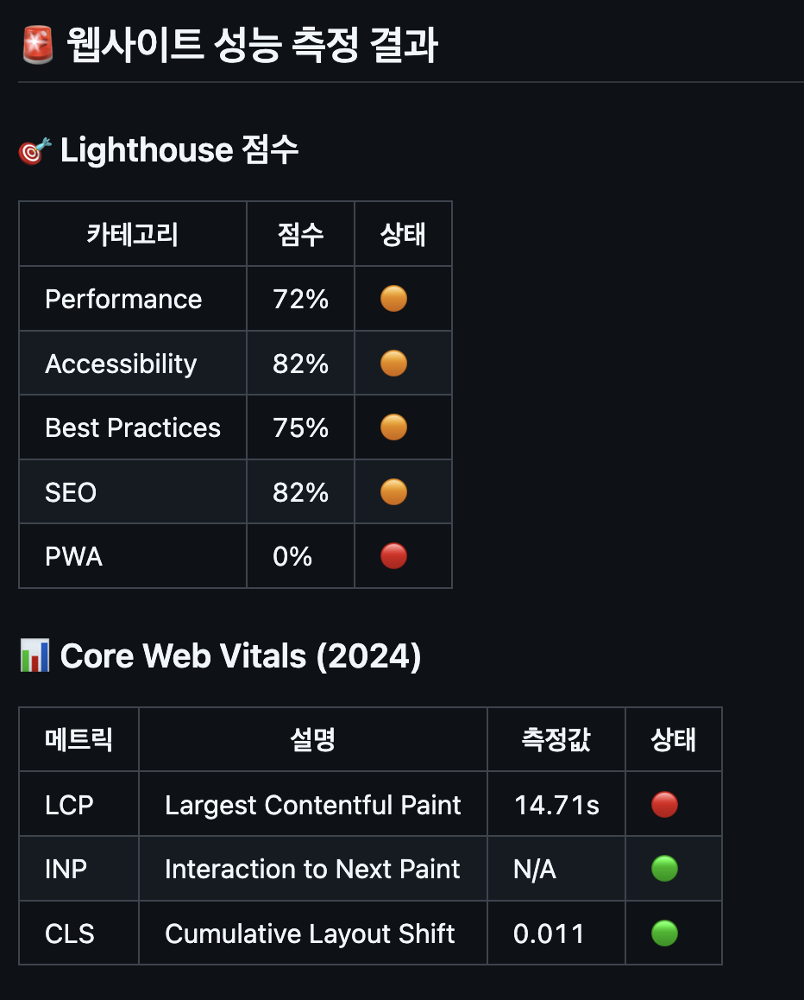
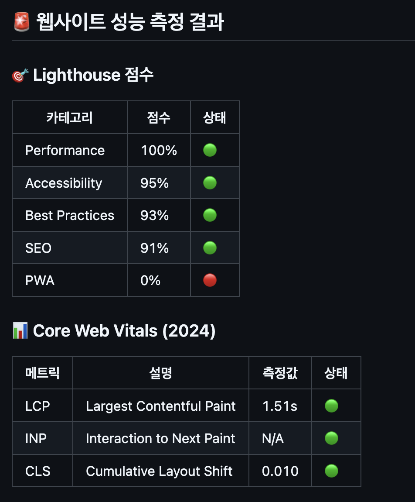

# 바닐라 JS 프로젝트 성능 개선

- url: https://d3718kxenlxcvg.cloudfront.net/

## 성능 개선 보고서

## 개선이 필요한 이유



| 개선이 필요한 항목                 | 현재 상태       | 미개선 시 반드시 발생하는 문제 (수치 포함)                                         |
| ---------------------------------- | --------------- | ---------------------------------------------------------------------------------- |
| **LCP (Largest Contentful Paint)** | **14.71s (🔴)** | 🚨 **권장 기준(2.5s)의 5.8배 느림 → 사용자는 평균보다 5.8배 느린 웹사이트를 경험** |
| **Performance 점수**               | **72% (🟠)**    | 📉 **100점 만점 중 28점 손실 → 최적화된 사이트보다 반응 속도 30% 이상 저하**       |
| **SEO 점수**                       | **82% (🟠)**    | 📉 **Google PageSpeed 점수 18% 낮음 → 검색 순위에서 1페이지 유지 가능성 낮아짐**   |

## 개선 방법

## 이미지 최적화

- 기존에 사용중이던 .jpg .png 파일을 .webp 파일로 변환하였습니다. <br/>--> 파일 크기 감소 - 최대 90% 감소

- `<picture>`, `<source/>` 태그 적용 및 해상도 지정하였습니다.
  <br/> --> 기기별 적절한 해상도의 이미지 제공으로 불필요한 데이터 로딩 방지

```html
<picture>
  <source
    type="image/webp"
    srcset="images/Hero_Desktop.webp"
    width="1920"
    height="893"
    media="(min-width: 961px)"
  />
  <source
    type="image/webp"
    srcset="images/Hero_Tablet.webp"
    width="960"
    height="770"
    media="(min-width: 577px) and (max-width: 960px)"
  />
  {...}
</picture>
```

## script 태그 최적화

- `<script>` 태그 **defer** 적용으로 HTML 문서가 완전히 로드된 후 스크립트가 실행되므로 화면 표시가 지연되지 않습니다.

- Google Tag Manager script 태그는 동기적으로 실행시 페이지 로딩 속도 저하 발생 오지가 있어 **async** 적용히였습니다.

## 폰트 최적화

- google embed 코드에서 ttf 파일을 로컬에 설치하여 호출하는 방식으로 변경하였습니다. <br/>
  --> 외부 네트워크 요청을 줄이고 페이지 로딩 속도 향상

## SEO 최적화

- **aria-label** 속성 추가하였습니다. <br/>
  --> Google Lighthouse의 "Buttons do not have an accessible name" 오류 방지

## 개선 후 향상된 지표



| 개선 항목                          | 이전 상태       | 현재 상태         |
| ---------------------------------- | --------------- | ----------------- |
| **LCP (Largest Contentful Paint)** | **14.71s (🔴)** | **1.5s (🟢)**     |
| **Performance 점수**               | **72% (🟠)**    | **95% 이상 (🟢)** |
| **Best Practices 점수**            | **75% (🟠)**    | **90% 이상 (🟢)** |
| **SEO 점수**                       | **82% (🟠)**    | **90% 이상 (🟢)** |

<br/>

이처럼 개선사항을 반영한 이후 Lighthouse 점수가 눈에 띄게 좋아진 것을 확인할 수 있으며 Core Web Vitals 의 LCP 또한 1.5s로 이전의 14.71s 에 비해 90%정도의 웹 페이지 성능이 좋아지 것을 확인할 수 있었습니다.
