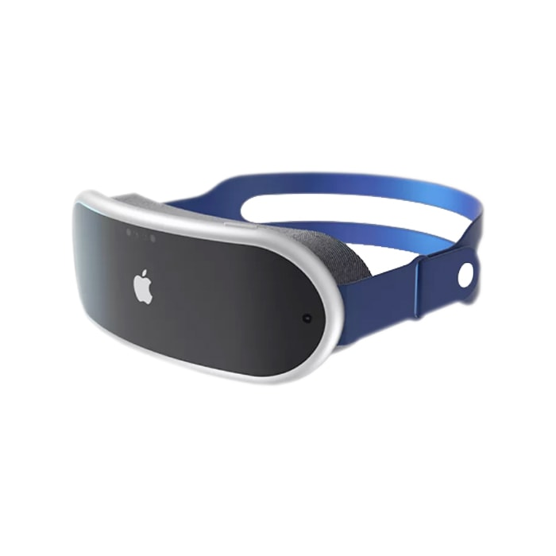
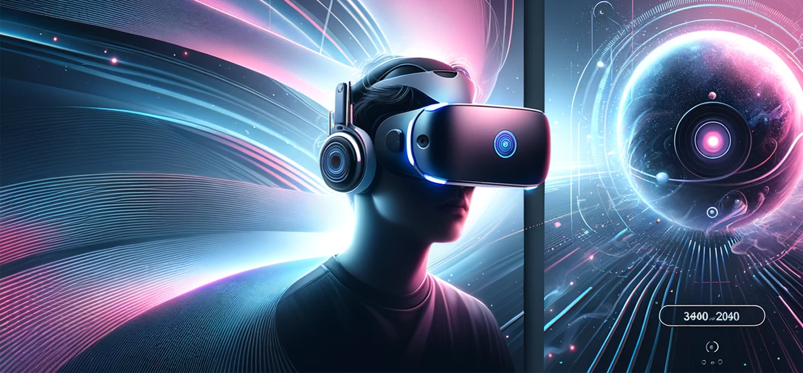

# 바닐라 JS 프로젝트 성능 개선 보고서

- **URL:** https://d18gzd9jk19h8u.cloudfront.net/

## 사전 지표 (개선 전)

### 🎯 Lighthouse 점수

| 카테고리       | 점수 | 상태 |
| -------------- | ---- | ---- |
| Performance    | 72%  | 🟠   |
| Accessibility  | 82%  | 🟠   |
| Best Practices | 75%  | 🟠   |
| SEO            | 82%  | 🟠   |
| PWA            | 0%   | 🔴   |

### 📊 Core Web Vitals (2024)

| 메트릭 | 설명                      | 측정값 | 상태 |
| ------ | ------------------------- | ------ | ---- |
| LCP    | Largest Contentful Paint  | 14.71s | 🔴   |
| INP    | Interaction to Next Paint | N/A    | 🟢   |
| CLS    | Cumulative Layout Shift   | 0.011  | 🟢   |

---

## 1. 개선 이유

- **LCP 지표 문제:**  
  초기 LCP가 14.71초로 매우 긴 로딩 시간을 보여주어, 사용자에게 첫 인상에서 심각한 지연을 초래하고 이탈률 증가로 이어질 수 있습니다.

- **전체 Lighthouse 점수:**  
  Performance(72%), Accessibility(82%), Best Practices(75%), SEO(82%) 등 전반적으로 평균 점수가 낮아 개선의 여지가 큽니다. 특히 성능과 접근성 측면에서 추가 개선이 필요합니다.

---

## 2. 개선 방법

### 2.1 LCP 개선

- **이미지 최적화:**

  - 이미지 사이즈 최적화, 압축 및 WebP와 같은 최신 포맷을 적용하였습니다.
  - 최신 포맷을 지원하지 않는 브라우저를 위해 `<picture>` 태그의 `<source>` 요소를 사용하여 구형 브라우저에서도 정상적으로 동작하도록 처리하였습니다.

    ```html
    <picture>
      <source srcset="images/vr1.webp" type="image/webp" />
      
    </picture>
    ```

  - 화면 크기에 맞춰 적절한 이미지만 불러오도록 하여 불필요한 이미지 로딩을 제거하였습니다.

    ```html
    <section class="hero">
      <picture>
        <!-- 모바일: 최대 576px -->
        <source
          width="576"
          height="576"
          media="(max-width: 576px)"
          srcset="images/Hero_Mobile.webp"
          type="image/webp"
        />
        <source
          width="576"
          height="576"
          media="(max-width: 576px)"
          srcset="images/Hero_Mobile.jpg"
          type="image/jpeg"
        />

        <!-- 태블릿: 최대 960px -->
        <source
          width="960"
          height="770"
          media="(max-width: 960px)"
          srcset="images/Hero_Tablet.webp"
          type="image/webp"
        />
        <source
          width="960"
          height="770"
          media="(max-width: 960px)"
          srcset="images/Hero_Tablet.jpg"
          type="image/jpeg"
        />

        <!-- 데스크탑: 기본으로 WebP 우선 -->
        <source
          width="1920"
          height="893"
          srcset="images/Hero_Desktop.webp"
          type="image/webp"
        />
        
      </picture>
    </section>
    ```

  - 화면에 즉시 보여질 필요가 없는 이미지는 lazy-loading 처리하였습니다.

    ```js
    const img = document.createElement("img");
    img.loading = "lazy";
    ```

- **코드 최적화 및 리소스 관리:**

  - Vite를 적용하여 자바스크립트와 CSS 파일의 번들 크기를 최적화하였습니다.
  - `<script>` 태그에 `defer`와 `async` 속성을 적절히 적용하여 렌더링 차단을 최소화하였습니다.

    ```html
    <script defer src="app.js"></script>
    <script async src="analytics.js"></script>
    ```

  - 무거운 연산 작업은 Web Worker로 위임하여 메인 스레드의 렌더링을 최적화하였습니다.

    ```js
    // products.js
    import Worker from "./worker.js?worker";

    const worker = new Worker();
    worker.postMessage({ action: "compute" });

    // worker.js
    self.onmessage = (event) => {
      const data = event.data;
      if (data.action === "compute") {
        for (let i = 0; i < 10_000_000_000; i++) {
          const temp = Math.sqrt(i) * Math.sqrt(i);
        }
      }
    };
    ```

- **서버 및 네트워크 최적화:**

  - **CloudFront**를 활용하여 캐싱 정책을 개선하고 서버 응답 시간을 최적화하였습니다.

- **레이아웃 변경 최적화:**
  - `setTimeout`을 통해 UI 업데이트를 지연시켜 레이아웃 변경을 최소화하였습니다.
  - `font-display` 속성을 `fallback`으로 설정하여 폰트 로딩 시 발생하는 레이아웃 이동 문제를 해결하였습니다.

### 2.2 접근성 및 SEO 개선

- **접근성 개선:**

  - 이미지의 대체 텍스트을 활용하여 접근성을 강화하였습니다.

- **SEO 및 모범 사례 준수:**
  - 메타 태그를 활용하여 사이트의 description 등 SEO 관련 요소를 보완하였습니다.

---

## 3. 개선 후 향상된 지표

### 🎯 Lighthouse 점수

| 카테고리       | 점수 | 상태 |
| -------------- | ---- | ---- |
| Performance    | 99%  | 🟢   |
| Accessibility  | 91%  | 🟢   |
| Best Practices | 93%  | 🟢   |
| SEO            | 100% | 🟢   |
| PWA            | 0%   | 🔴   |

### 📊 Core Web Vitals (2024)

| 메트릭 | 설명                      | 측정값 | 상태 |
| ------ | ------------------------- | ------ | ---- |
| LCP    | Largest Contentful Paint  | 2.12s  | 🟢   |
| INP    | Interaction to Next Paint | N/A    | 🟢   |
| CLS    | Cumulative Layout Shift   | 0.000  | 🟢   |

### 요약

| 항목               | 개선 전     | 개선 후 (실제) | 개선율        |
| ------------------ | ----------- | -------------- | ------------- |
| **LCP**            | 14.71s (🔴) | 2.12s          | 약 85.6% 감소 |
| **Performance**    | 72% (🟠)    | 99%            | 약 37.5% 증가 |
| **Accessibility**  | 82% (🟠)    | 91%            | 약 11% 증가   |
| **Best Practices** | 75% (🟠)    | 93%            | 약 24% 증가   |
| **SEO**            | 82% (🟠)    | 100%           | 약 22% 증가   |

---

## 4. 기타 및 향후 계획

- **백엔드 개선 작업:**  
  API를 통해 전송되는 이미지에 대해 압축 및 최신 포맷 적용 작업을 진행할 예정입니다.

- **모니터링 및 유지보수:**
  - Google Analytics 등 실시간 모니터링 도구를 도입하여 지속적으로 성능을 추적합니다.
  - 주기적인 재측정 및 피드백 반영을 통해 추가 개선 사항을 도출하고 업데이트할 계획입니다.
