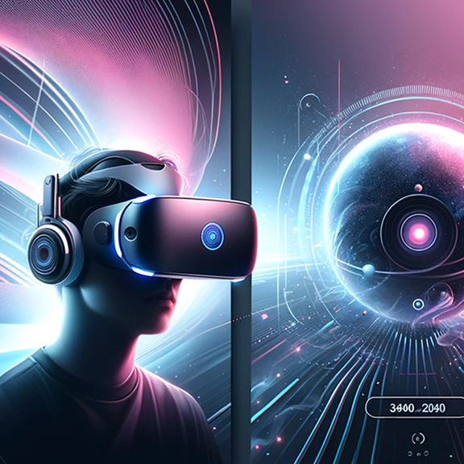
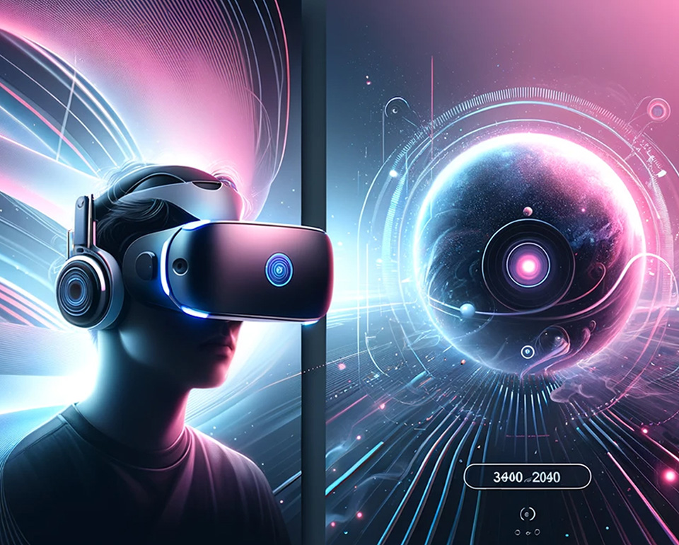

# 웹사이트 성능 최적화 보고서
## 파이프라인 구축
> 배포 URL : https://github.com/devJayve/front_4th_chapter4-2_basic/issues/7#issue-2880394076  

배포의 경우 9주차와 동일한 파이프라인으로 S3, Cloudfront를 이용하였습니다.
S3 버킷에 배포한 뒤 Github action 시크릿 값에 포함된 Cloudfront URL을 기준으로 3회 반복 Lighthouse Metric 측정을 수행하였습니다.

deployment.yml에서 lighthouse.yml을 실행할 경우 환경 변수를 lighthouse.yml에서도 접근하기 위해 아래와 같이 secrets를 지정 혹은 상속하도록 설정해주어야 합니다.
```yaml
lighthouse:
    needs: deploy
    uses: ./.github/workflows/lighthouse.yml
    secrets: inherit
```

## 사전 지표
[Github Issue](https://github.com/devJayve/front_4th_chapter4-2_basic/issues/7)

### 🎯 Lighthouse 점수
| 카테고리           | 점수  | 상태 |
|----------------|-----|----|
| Performance    | 72% | 🟠 |
| Accessibility  | 82% | 🟠 |
| Best Practices | 93% | 🟢 |
| SEO            | 82% | 🟠 |
| PWA            | 0%  | 🔴 |

### 📊 Core Web Vitals (2024)
| 메트릭 | 설명                        | 측정값    | 상태 |
|-----|---------------------------|--------|----|
| LCP | Largest Contentful Paint  | 13.36s | 🔴 |
| INP | Interaction to Next Paint | N/A    | 🟢 |
| CLS | Cumulative Layout Shift   | 0.011  | 🟢 |

### 🚀PageSpeed Insights
| 메트릭         | 점수   | 상태 |
|-------------|------|----|
| FCP         | 0.7초 | 🟢 |
| LCP         | 2.9초 | 🔴 |
| Speed Index | 0.8초 | 🟢 |

공통적으로 LCP 지표에 대해 낮은 성능 지표를 보여주고 있으며 접근성과 SEO 지표에 대한 개선이 필요합니다.
또한 서비스 로직을 점검해보면서 성능을 개선할 수 있는 포인트를 찾아 개선해보겠습니다.
초기 측정 결과, 특히 LCP(Largest Contentful Paint) 지표가 13.36초로 Google 권장 기준(2.5초)을 초과하여 성능 저하를 보이고 있습니다.
또한 접근성(82%)과 SEO(82%) 지표도 '양호' 수준에 머물러 개선의 여지가 있습니다.
이를 해결하기 위해 이미지 최적화, 리소스 로딩 전략 개선, 코드 분할 등 서비스 로직 전반에 걸친 성능 병목 지점을 체계적으로 분석하고 최적화 방안을 도출하여 구현하겠습니다.

## 개선 과정
### 1. [이미지 최적화](https://github.com/devJayve/front_4th_chapter4-2_basic/issues/8)
/images 폴더 내 위치한 이미지의 경우 png,jpg 파일 형식으로 구성되어있습니다. 
이에 비해 **WebP는 일반적으로 PNG보다 26%, JPG보다 25-34% 더 작은 파일 크기를 제공**합니다.
뿐만 아니라 손실 및 무손실 압축을 모두 지원하면서도 더 높은 압축률을 가지기 때문에 데이터 전송량이 줄어 **LCP 지표를 개선**할 수 있습니다.

그러나 Internet Explorer 11 이하, Safari 13 이하 및 일부 구형 브라우저에서 webP 파일 형식을 지원하지 않을 수 있기 때문에 별도로 대응이 필요합니다.
아래와 같이 `<picture>` 태그를 사용하여 webP와 함께 대체 이미지 형식을 제공할 수 있습니다.
```html
<picture>
  <source srcset="image.webp" type="image/webp">
  
</picture>
```

### 2. [상품 지연 로딩](https://github.com/devJayve/front_4th_chapter4-2_basic/issues/9)
상품을 로드하고 보여주는 product.js의 경우 `loadProduct` 함수를 JS 로드 즉시 실행하도록 되어있습니다.
뿐만 아니라 무거운 작업(가정)을 for문을 통해 그대로 실행함으로써 메인 스레드에 Blocking이 발생하여 UI의 반응성이 떨어질 수 있습니다.
```javascript
loadProducts();

for (let i = 0; i < 10000000; i++) {
    const temp = Math.sqrt(i) * Math.sqrt(i);
}
```

먼저 상품의 경우 페이지를 내려 상품 UI에 도달하는 시점에 로드하도록 개선할 수 있습니다.
또한 status를 두어 연속적으로 스크롤이 발생할 때 중복 실행을 방지해주었습니다.
```javascript
window.onload = () => {
    let status = 'idle';

    let productSection = document.querySelector('#all-products');


    window.onscroll = () => {
        let position = productSection.getBoundingClientRect().top - (window.scrollY + window.innerHeight);

        if (status === 'idle' && position <= 0) {
            status = 'loading';

            loadProducts();
            ...
        }
    }
}
```
`loadProduct()` 실행 이후 무거운 작업을 수행해주어야 합니다.
이때 UI 응답성을 개선하기 위해 작업을 작은 청크 단위로 분리하고 각 청크 사이에 `setTimeout()`을 사용하여 메인 스레드를 주기적으로 해제합니다.
```javascript
setTimeout(() => {
    // 무거운 작업을 청크(chunk)로 나누어 처리
    processHeavyCalculationInChunks(10000000, () => {
        status = 'complete';
    });
}, 0);
```
지연 로드로 인해 초기 페이지 로드 시간인 FCP와 LCP 개선을 기대할 수 있습니다.
또한 무거운 작업을 분산하여 처리함으로써 TBT(Total Blocking Time), INP(Interaction to Next Paint) 개선 또한 기대할 수 있습니다.

### 3. [헤더 레이아웃 shift 개선](https://github.com/devJayve/front_4th_chapter4-2_basic/issues/10)
기존 코드에서 헤더가 초기 hidden 속성에서 뒤늦게 로드됨에 따라 헤더 정보를 포함한 뒤 hidden 속성을 제거하고 있습니다.
이러한 방식은 헤더 UI가 생성되면서 레이아웃 Shift가 발생하여 사용자 경험을 저하시킬 수 있습니다.
```javascript
function showTopBar(){
    let country = "France";
    let vat = 20;
    setTimeout(() => {
        document.querySelector("section.country-bar")
            .innerHTML = `<p>Orders to <b>${country}</b> are subject to <b>${vat}%</b> VAT</p>`
        document.querySelector("section.country-bar")
            .classList.remove('hidden')
    }, 1000);
}
```

자연스러운 동작을 위해 헤더 hidden 속성을 제거해줍니다.
```javascript
<section class="country-bar">
</section>
```

### 4. [JS 스크립트 병렬 실행](https://github.com/devJayve/front_4th_chapter4-2_basic/issues/11)
쿠키 정책 설정 및 동의 등을 위해 아래와 같이 두 개의 스크립트를 실행하고 있습니다.
스크립트 실행이 우선순위가 높지 않음에도 스크립트가 HTML 파싱을 차단하여 렌더링을 지연시키고 있으며 스크립트 로드 시점이 불분명하여 콘솔 상에 에러가 발생하고 있습니다. 
```javascript
<script type="text/javascript" src="//www.freeprivacypolicy.com/public/cookie-consent/4.1.0/cookie-consent.js" charset="UTF-8"></script>
<script type="text/javascript" charset="UTF-8">
    cookieconsent.run({"notice_banner_type":"simple","consent_type":"express","palette":"light","language":"en","page_load_consent_levels":["strictly-necessary"],"notice_banner_reject_button_hide":false,"preferences_center_close_button_hide":false,"page_refresh_confirmation_buttons":false,"website_name":"Performance Course"});
</script>
```

다음과 같이 스크립트를 `defer`를 통해 백그라운드에서 병렬로 다운로드하도록 변경해줄 수 있습니다.
브라우저는 HTML 파싱을 계속 진행하면서 스크립트를 다운로드하기 때문에 초기 렌더링 속도를 개선할 수 있습니다.
또한 `cookieconsent.run()`의 호출 시점을 렌더링 이후 초기화하도록 `DOMContentLoaded` 이벤트 이후로 지연시켜줌으로써 cookieconsent 객체에 안전하게 접근하도록 변경해주었습니다.
```javascript
<script defer type="text/javascript" src="//www.freeprivacypolicy.com/public/cookie-consent/4.1.0/cookie-consent.js" charset="UTF-8"></script>
<script defer type="text/javascript" charset="UTF-8">
    document.addEventListener('DOMContentLoaded', function () {
        cookieconsent.run({"notice_banner_type":"simple","consent_type":"express","palette":"light","language":"en","page_load_consent_levels":["strictly-necessary"],"notice_banner_reject_button_hide":false,"preferences_center_close_button_hide":false,"page_refresh_confirmation_buttons":false,"website_name":"Performance Course"});
    });
</script>
```

### 5. [폰트 최적화](https://github.com/devJayve/front_4th_chapter4-2_basic/issues/12)
기존 폰트의 경우 외부 서버(Google Fornts)로의 요청을 통해 폰트 파일을 로드하고 있습니다.
이러한 외부 폰트 스타일시트는 렌더링 차단 리소스로 간주되어 페이지 로드를 지연시킬 수 있습니다.
```javascript
<link href="https://fonts.googleapis.com/css?family=Heebo:300,400,600,700&display=swap" rel="stylesheet">
```

로컬 폴더 내에 폰트 파일을 포함한 뒤 font-face를 직접 정의하여 외부 서보로로의 네트워크 요청을 제거하고 다운로드 속도를 향상시킬 숭 ㅣㅆ습니다.
```css
@font-face {
    font-family: 'Heebo';
    src: url('fonts/Heebo-Regular.ttf') format('truetype');
    font-display: swap;
    font-weight: 400;
    font-style: normal;
}
```

### 6. [이미지 반응형 최적화](https://github.com/devJayve/front_4th_chapter4-2_basic/issues/13)
메인 배너 이미지의 경우 width, height가 명시적으로 정의되어있지 않고 불필요하게 모든 이미지를 함께 로드하고 있습니다.
```html



```

이를 `media` 속성을 통해 반응형으로 화면 크기에 맞는 최적화된 이미지를 제공하도록 변경하였습니다.
또한 width, height 속성을 명시하여 브라우저가 이미지 공간을 미리 예약해 레이아웃 이동을 방지하였습니다.
```html
<picture>
    <source width="576" height="576" media="(max-width: 575px)" srcset="images/Hero_Mobile.webp">
    <source width="960" height="770" media="(min-width: 576px) and (max-width: 960px)" srcset="images/Hero_Tablet.webp">
    
</picture>
```

### 7. [접근성 개선](https://github.com/devJayve/front_4th_chapter4-2_basic/issues/14)
일부 색상 및 배경 색상의 경우 화면 대비율이 좋지 않아 접근성이 떨어지는 이슈가 존재했습니다.
따라서 대비율을 높이기 위해 색상을 조절해주었습니다.
```css
.hero-content button {
    background-color: #166a77;
}

.original-price {
    color: #656464;
}
```
또한 이미지 내에 alt 속성을 추가하여 페이지 이미지에 대한 접근성을 높였습니다.
```html

```

### 8. [meta 정보 추가](https://github.com/devJayve/front_4th_chapter4-2_basic/issues/15)
SEO 측면에서 검색 엔진의 이해도를 높이고 키워드 최적화, 소셜 미디어 등을 통한 공유 콘텐츠에 대한 최적화를 위해 아래와 같이 meta 태그를 추가해주었습니다.
```html
<head>
    <meta charset="UTF-8">
    <meta name="viewport" content="width=device-width, initial-scale=1.0">
    <meta name="description" content="Discover premium VR headsets from top brands including Apple, PlayStation, and Oculus. Shop our best-selling virtual reality products for immersive gaming and experiences.">
    <meta name="keywords" content="VR headsets, virtual reality, Apple headset, PlayStation VR, Oculus, gaming headsets">
    <meta name="author" content="VR Headsets">
    <meta property="og:title" content="Premium VR Headsets - Tech Shop">
    <meta property="og:description" content="Explore our collection of high-quality VR headsets from leading brands. Find the perfect virtual reality headset for gaming and immersive experiences.">
    <meta property="og:image" content="https://yourwebsite.com/images/vr1.webp">
    <meta property="og:url" content="https://yourwebsite.com">
    <meta property="og:type" content="website">
</head>
```

## 사후 지표
### 🎯 Lighthouse 점수
| 카테고리           | 초기 점수 | 최종 점수 | 상태 | 성능 개선율 |
|----------------|-------|-------|----|--------|
| Performance    | 72%   | 100%  | 🟢 | 1.38배  |
| Accessibility  | 82%   | 98%   | 🟢 | 1.19배  |
| Best Practices | 93%   | 93%   | 🟢 | 0배     |
| SEO            | 82%   | 100%  | 🟢 | 1.21배  |
| PWA            | 0%    | 0%    | 🔴 | 0배     |

### 📊 Core Web Vitals (2024)
| 메트릭 | 설명                        | 초기 측정값 | 최종 측정값 | 상태 | 성능 개선율 |
|-----|---------------------------|--------|--------|----|-------|
| LCP | Largest Contentful Paint  | 13.36s | 1.51s  | 🟢 | 8.84배 |
| INP | Interaction to Next Paint | N/A    | N/A    | 🟢 | N/A   |
| CLS | Cumulative Layout Shift   | 0.011  | 0.001  | 🟢 | 11배   |

### 🚀PageSpeed Insights
| 메트릭         | 초기 점수 | 최종 점수 | 상태 | 성능개선율 |
|-------------|-------|-------|----|-------|
| FCP         | 0.7s  | 0.2s  | 🟢 | 3.5배  |
| LCP         | 2.9s  | 0.7s  | 🔴 | 4.14배 |
| Speed Index | 0.8s  | 0.3s  | 🟢 | 2.66배 |
| TBT         | -     | 0ms   | 🟢 | -     |
| CLS         | -     | 0.002 | 🟢 | -     |
