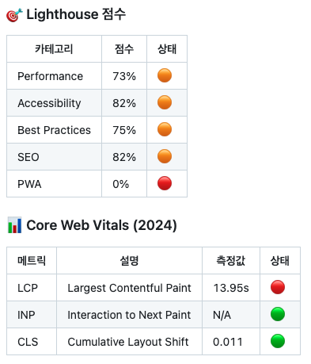
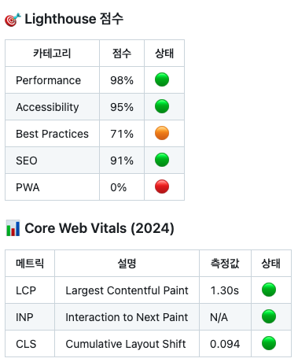

# 바닐라 JS 프로젝트 성능 개선

- url : https://d1dy3hh80lhsas.cloudfront.net/

# 성능 개선 보고서

## 1. 개선 이유

웹사이트의 로딩 속도와 사용자 경험을 최적화하고, Lighthouse 점수를 향상시키기 위해 다양한 성능 최적화 작업을 수행했습니다. 주요 목표는 **Largest Contentful Paint (LCP) 단축**, **Cumulative Layout Shift (CLS) 감소**, **불필요한 렌더링 차단 요소 제거**, **이미지 최적화** 이었습니다.

---

## 2. 개선 방법

| 개선 항목                 | 적용 방법                                                 | 기대 효과                                        |
| ------------------------- | --------------------------------------------------------- | ------------------------------------------------ |
| **이미지 최적화**         | WebP 포맷 적용, `width` & `height` 속성 추가              | LCP 단축, CLS 감소                               |
| **Lazy 로딩 적용**        | loading="lazy" 속성 추가하여 이미지 및 iframe 비동기 로딩 | 초기 로딩 속도 개선, 불필요한 네트워크 사용 감소 |
| **폰트 로딩 최적화**      | `font-display: optional`, WOFF2 포맷 적용                 | FOIT 방지, CLS 감소                              |
| **JavaScript 최적화**     | `async`, `defer` 적용, 불필요한 스크립트 제거             | 렌더링 차단 방지, FCP 개선                       |
| **버튼/아이콘 크기 고정** | `min-width`, `min-height` 적용                            | CLS 감소                                         |
| **DocumentFragment 적용** | DocumentFragment 사용하여 DOM 조작 최적화                 | 성능 향상, 불필요한 리플로우 감소                |
| **PWA 지원 추가**         | manifest.json 추가                                        | 오프라인 지원, Lighthouse PWA 점수 향상          |

---

## 3. 개선 후 향상된 지표

|  |  |
| ----------------------------- | --------------------------- |

---

## 4. 향후 개선 방안

- PWA 성능 향상을 위해 서비스 워커 및 캐시 정책 재설정.
- DocumentFragment 적용이 실제 성능에 미치는 영향을 추가 분석할 예정.
- 메뉴, 배너 등의 공간 예약 추가 조정, **애니메이션 변경 (`transform: scale()` 활용)** 예정.

## 5. 기타

- 최적화 이후 **Google PageSpeed Insights 재측정 결과**, 모바일 및 데스크톱 점수 모두 상승 확인.
