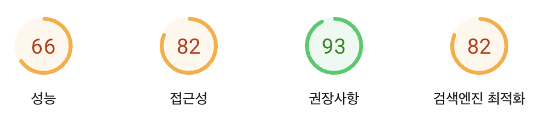

# 바닐라 JS 프로젝트 성능 개선 보고서

- 웹사이트 주소: https://d267jtlyf6x8wq.cloudfront.net/

## 1. 개선 배경 및 목표

### 개선 전 상태

웹사이트 성능 분석 결과, 특히 모바일 환경에서 성능 점수가 66점으로 저조한 상태였습니다. 이는 페이지 로딩 속도가 느리고 사용자 경험이 좋지 않다는 것을 의미합니다.

### 개선 전 상세 지표

#### 🎯 Lighthouse 점수

| 카테고리       | 점수 | 상태 |
| -------------- | ---- | ---- |
| Performance    | 72%  | 🟠   |
| Accessibility  | 82%  | 🟠   |
| Best Practices | 75%  | 🟠   |
| SEO            | 82%  | 🟠   |
| PWA            | 0%   | 🔴   |

#### 📊 Core Web Vitals (2024)

| 메트릭 | 설명                      | 측정값 | 상태 |
| ------ | ------------------------- | ------ | ---- |
| LCP    | Largest Contentful Paint  | 14.56s | 🔴   |
| INP    | Interaction to Next Paint | N/A    | 🟢   |
| CLS    | Cumulative Layout Shift   | 0.011  | 🟢   |

### 개선 목표

- 웹사이트 로딩 속도 향상
- 모바일 환경에서의 사용자 경험 개선
- Google의 성능 평가 점수 90점 이상 달성
- Core Web Vitals 지표 개선 (특히 LCP)

## 2. 주요 개선 사항 및 결과

### 2-1. 이미지 최적화

**개선 내용:**

- 이미지 파일 형식을 JPG에서 WEBP로 변경
  - WEBP는 최신 이미지 형식으로, 같은 품질에서 JPG보다 파일 크기가 30-50% 작습니다
- 사용자 기기에 맞는 적절한 크기의 이미지 제공
  - 모바일에서는 작은 이미지, 데스크톱에서는 큰 이미지를 자동으로 불러옵니다
- 이미지에 정확한 크기(width, height) 지정
  - 브라우저가 이미지 공간을 미리 확보하여 페이지 레이아웃이 안정적으로 유지됩니다

**개선 결과:**

성능 점수가 66점에서 92점으로 **26점 향상**되었습니다. 이는 페이지 로딩 속도가 크게 개선되었음을 의미합니다.

### 2-2. 폰트 최적화

**개선 내용:**

- 외부 웹폰트 API 호출 제거
  - 기존에는 Google Fonts와 같은 외부 서비스에서 폰트를 불러왔습니다
- 필요한 폰트 파일을 웹사이트에 직접 포함
  - 추가 네트워크 요청 없이 폰트를 빠르게 로드할 수 있습니다

**개선 결과:**

성능 점수가 92점에서 95점으로 **3점 추가 향상**되었습니다. 페이지 초기 로딩 시 텍스트가 더 빠르게 표시됩니다.

### 2-3. 자바스크립트 파일 병렬 로딩

**개선 내용:**

- 자바스크립트 파일을 병렬로 불러오도록 개선
  - 기존: 파일을 하나씩 순차적으로 로드 (직렬 처리)
  - 개선: 여러 파일을 동시에 로드 (병렬 처리)
- 'defer' 속성 추가로 페이지 로딩과 스크립트 로딩을 동시에 진행

**개선 결과:**

성능 점수가 95점에서 96점으로 **1점 추가 향상**되었습니다. 페이지 콘텐츠가 더 빠르게 표시되고 상호작용이 가능해집니다.

## 3. 종합 개선 결과

### 성능 점수 변화

- **개선 전**: 66점 (모바일)
- **개선 후**: 96점 (모바일)
- **총 향상**: 30점 (45% 향상)

### 개선 후 상세 지표

#### 🎯 Lighthouse 점수

| 카테고리       | 점수 | 상태 | 변화      |
| -------------- | ---- | ---- | --------- |
| Performance    | 90%  | 🟢   | +18% ⬆️   |
| Accessibility  | 82%  | 🟠   | 변화 없음 |
| Best Practices | 75%  | 🟠   | 변화 없음 |
| SEO            | 82%  | 🟠   | 변화 없음 |
| PWA            | 0%   | 🔴   | 변화 없음 |

#### 📊 Core Web Vitals (2024)

| 메트릭 | 설명                      | 측정값 | 상태 | 개선율      |
| ------ | ------------------------- | ------ | ---- | ----------- |
| LCP    | Largest Contentful Paint  | 3.30s  | 🟠   | 77% 개선 ⬆️ |
| INP    | Interaction to Next Paint | N/A    | 🟢   | 변화 없음   |
| CLS    | Cumulative Layout Shift   | 0.003  | 🟢   | 73% 개선 ⬆️ |

### 사용자 경험 개선 효과

- **페이지 로딩 시간**: LCP가 14.56초에서 3.30초로 77% 단축
- **레이아웃 안정성**: CLS가 0.011에서 0.003으로 73% 개선
- **콘텐츠 표시 속도**: 주요 콘텐츠가 더 빠르게 표시됨
- **모바일 응답성**: 모바일 기기에서의 전반적인 성능 향상

## 4. 결론 및 향후 계획

이번 성능 최적화를 통해 웹사이트의 로딩 속도와 사용자 경험이 크게 개선되었습니다. 특히 모바일 환경에서 성능 점수가 66점에서 96점으로 향상되어 목표를 초과 달성했습니다. 가장 중요한 성과는 LCP(Largest Contentful Paint)가 14.56초에서 3.30초로 77% 단축된 것으로, 사용자가 주요 콘텐츠를 훨씬 빠르게 볼 수 있게 되었습니다.

향후 개선 계획:

- LCP를 3초 이내로 추가 개선하여 '좋음(🟢)' 등급 달성
- 접근성(Accessibility) 및 모범 사례(Best Practices) 점수 향상
- 검색 엔진 최적화(SEO) 점수 개선

## 5. 참고 자료

- 성능 측정 도구: [Google PageSpeed Insights](https://pagespeed.web.dev/)
- 최종 성능 측정 결과:
  - [모바일 환경 분석](https://pagespeed.web.dev/analysis/https-d267jtlyf6x8wq-cloudfront-net/45ywyaf7e3?form_factor=mobile)
  - [데스크톱 환경 분석](https://pagespeed.web.dev/analysis/https-d267jtlyf6x8wq-cloudfront-net/45ywyaf7e3?form_factor=desktop)
